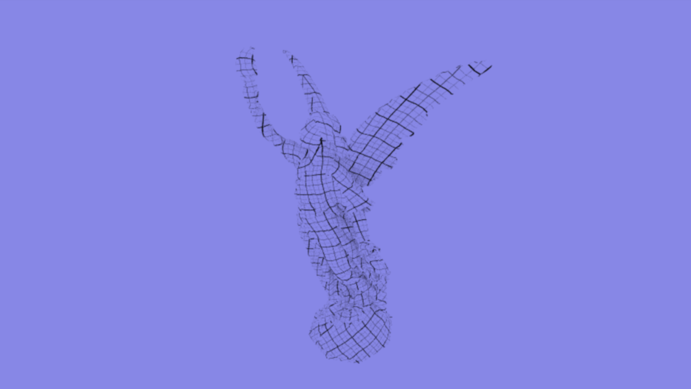

# What is Soul Engine?
Soul Engine is a physically based renderer and engine for real-time applications on any 
system with CUDA (primary) or OpenCL (secondary) support. 

(This is image is produced after 10 seconds of accumulation on a low-tier graphics card)

#Features
These are planned features (partial/incomplete implementations) for aid in the vision of the final application.

  -Spectral bidirectional path tracer
  
  -GPU physics pipeline which includes an FEM solver for all objects
  
  -A ray engine which handles ray requests and processes them in bulk.
  
  -Sound path tracing with a multi-listener setup.
  
  -Shader system allowing for immediate artist controlled changes.
  
  -Fiber implementation for task based CPU processing.
  
  -Calculation determinism allowing for lockstep networking.
  
# Current Status
Completed features:

  -The ray engine allows for any code to request a parrallel ray job near rendertime. Jobs are coalesced, at the cost of minor overhead, and sent into the scene to collect information. 
  
  -Basic path tracing is available using only diffuse materials.
  
  -LBVH implementation is complete
  
  -Scenes can be created and sent for rendering

Ways to interact with Soul Engine beyond this repository are currently being investigated.
For your propiertery purposes, an alternate license will be also made available once the project is in a decent enough shape.

Check out the currently open issues for opportunities to contribute!

# User (programmer) Setup
To compile dependancies with the following must be met:

  GLFW          - http://www.glfw.org/
  
  GLM           - http://glm.g-truc.net/0.9.8/index.html
  
  stb_image.h   - https://github.com/nothings/stb
  
  Vulkan SDK    - https://lunarg.com/vulkan-sdk/
  
  Boost         - http://www.boost.org/
  
  GLEW          - http://glew.sourceforge.net/ 
  
  Cuda 8.0      - https://developer.nvidia.com/cuda-toolkit
  
  tinyobjloader - https://github.com/syoyo/tinyobjloader
