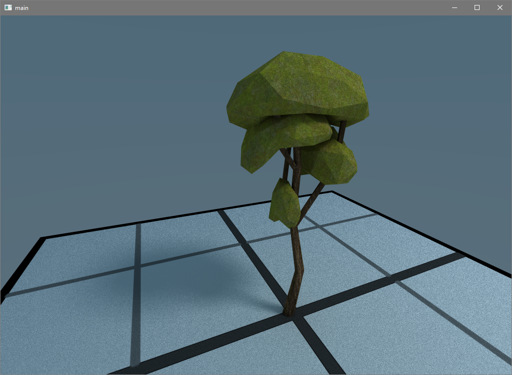

# Soul Engine
[](https://travis-ci.org/Synodic-Software/Soul-Engine.svg?branch=master)
[](https://ci.appveyor.com/project/AsherNorland/soul-engine)

# What is Soul Engine?
Soul Engine is a physically based renderer and engine for real-time applications. It is cross-platform with CUDA (primary) or OpenCL (secondary) support for computation tasks. 


(This is image is produced after 5 seconds of accumulation on a consumer graphics card)

Ways to interact with Soul Engine beyond this repository are currently being investigated.
For your propiertery purposes, an alternate license will be also made available once the project is near feature complete.

Check out the currently open [issues](https://github.com/Behemyth/Soul-Engine/issues) for opportunities to contribute!

# User (programmer) Setup
To compile within the visual studio project dependancies with the following must be met:

  - GLFW          - http://www.glfw.org/
  
  - GLM           - http://glm.g-truc.net/0.9.8/index.html
  
  - stb_image.h   - https://github.com/nothings/stb
  
  - Vulkan SDK    - https://lunarg.com/vulkan-sdk/
  
  - Boost 1.64    - http://www.boost.org/
  
  - GLEW          - http://glew.sourceforge.net/ 
  
  - Cuda 8.0      - https://developer.nvidia.com/cuda-toolkit
  
  - OpenCL	  - http://developer.amd.com/amd-accelerated-parallel-processing-app-sdk/
  
  - tinyobjloader - https://github.com/syoyo/tinyobjloader
  
Soul Engine can be compiled in Microsoft Visual Studio 2015.
  
# Example Usage

```

#include "SoulCore.h"

int main()
{
	SoulInit();

	EventManager::Listen("Input", "ESCAPE", [](keyState state) {
		if (state == RELEASE) {
			SoulSignalClose();
		}
	});

	//create a Window
	GLFWwindow* win=SoulCreateWindow(0, 0.95f, 0.95f);

	Material* whiteGray = new Material();
	whiteGray->diffuse = glm::vec4(1.0f, 0.3f, 0.3f, 1.0f);
	whiteGray->emit = glm::vec4(0.0f, 0.0f, 0.0f, 1.0f);

	Scene* scene = new Scene();
	AddObject(scene, glm::vec3(0, 0, 0), "Rebellion.obj", whiteGray);

	SubmitScene(scene);

	SoulRun();

	return 0;
}
```

The documentation Wiki for Soul Engine can be found [here](https://github.com/Behemyth/Soul-Engine/wiki/Documentation).
